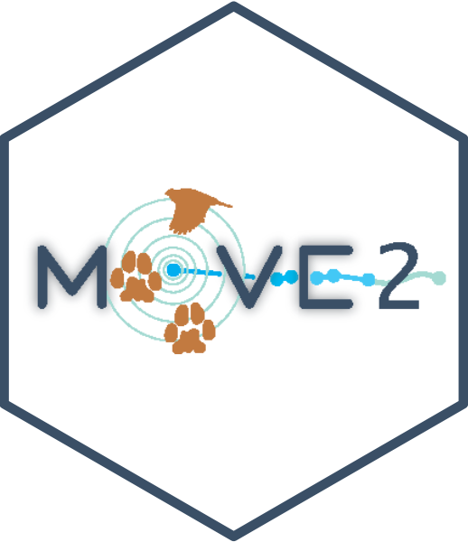

# move2universe — hex logo design brief

**Status: draft for feedback (Anne + team).** This is *direction and rationale
only* — the artwork is Anne's to execute, in her design language. Please
comment and redirect freely.

## Starting point — Anne's move2 mark

This is the basis for the family. What it does well:

- The **"O" of move2 reimagined as a telemetry emblem** — concentric rings
  around a fix, a tagged **bird** above and **paw prints** below, a **GPS track
  of fixes** flowing off to the right. It reads instantly as *tracking tagged
  animals*.
- A warm, field-ecology palette (slate / terracotta / teal / blue on white).
- Crucially, the mark **commands the whole hex** — the wordmark *is* the
  composition, with the emblem carried in the "O".

### The Movebank lineage (intentional — keep it)

The concentric-ring emblem deliberately echoes **Movebank's** mark. That's a
strength: Movebank (MPI-AB's own platform) is the data foundation the whole
`move` / `move2` / `move2utils` ecosystem reads from, so a Movebank-nodding
motif roots move2universe in its data home. In-house, so no external-identity
concern — the rule is to keep it a *nod*, not a copy.

## Composition principle (every hex)

A hex works when the mark **fills the available area**. Either bold integral
lettering (Anne's route) or a strong central icon using most of the hex, with
the package name **placed and scaled with intent** — curved along the bottom
inner edge, sized to the available width — not a small motif floating in a large
empty field with tiny text in a corner.

## move2universe — the "umbrella" mark

Concept: an **orbital system** — `move2` as a bright core, the package family as
bodies orbiting it; the orbits = the *universe*.

**Critical note from review:** flat concentric rings read as a **shooting
target**, not a cosmos. Render the orbits in **perspective — tilted ellipses (a
planetary system) or a galaxy swirl** so it reads as a *system*. Done that way
it still nods to Movebank's rings without inheriting the flat-target look. A
faint GPS track can trail off as the "movement" thread.

## move2utils — package mark

Concept: **tools.** *utils = utilities = tools* — and the package's own framing
is the **"Swiss-army knife" of move2 utilities**. So the natural mark is a
**multi-tool / Swiss-army knife whose implements are movement motifs** — a blade
that's a track segment, a utilisation-distribution contour, a corridor line, a
speed gauge. It says "toolkit" at a glance and fills the hex. (An earlier
UD-cloud idea was too literal and too quiet — dropped.)

## Family system

One hex + one palette; the motif varies per package so the set coheres:

- **move2universe** — orbital system / galaxy (above).
- **move2utils** — Swiss-army multi-tool of movement motifs.
- **move2imu** — an accelerometer waveform / IMU trace.
- **move2env** — a track over an environmental raster.

The richer tagged-animal motifs (Anne's bird + paws) suit the individual package
marks; the umbrella stays the "system" view.

## Palette

Approximate values from Anne's mark — please replace with the exact swatches
from the source file:

| Role | Hex |
|---|---|
| Slate (border, wordmark) | `#3E5871` |
| Terracotta (animals / accents) | `#BC6C3C` |
| Teal (rings / orbits) | `#6FB0A6` (light `#A9D6CE`) |
| Bright blue (track / fixes) | `#1F9FD8` |
| Background | `#FFFFFF` |

## Open questions for the team

1. Umbrella: orbital system vs. galaxy swirl — and how literal/stylised?
2. move2utils: Swiss-army multi-tool — implements as movement motifs, or a
   cleaner single-tool icon?
3. Wordmark: lowercase, curved along the bottom edge, sized to fill the width?
4. Keep Anne's palette as the family standard (and harmonise the ring-teal and
   track-blue onto one ramp)?
5. Is the Movebank nod at the right distance — homage, not copy, and not a
   target?

## Production

Final assets as **vector** (the `hexSticker` R package, or Illustrator /
Inkscape) — not quick R plots. Finished with Anne.

## Credits

Original move2 mark and design language: **Anne K. Scharf**. This brief drafted
for review; final artwork to be finished with Anne.
