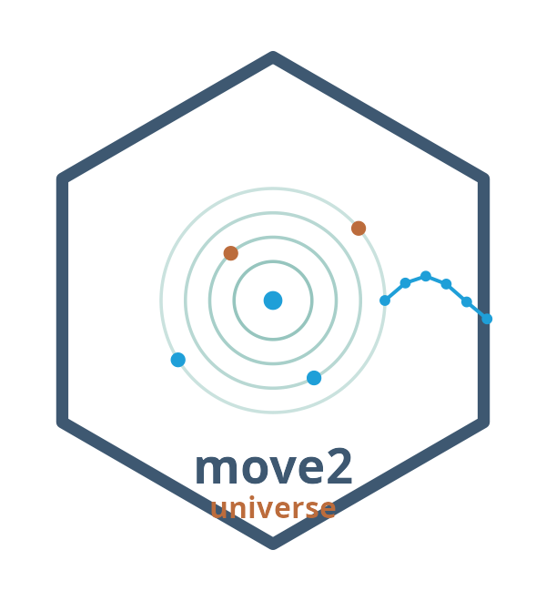
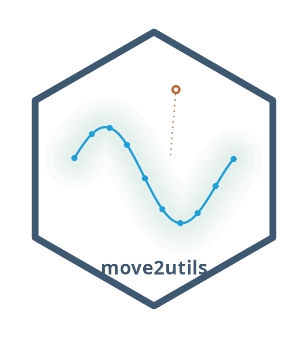

# move2universe — hex logo design brief

**Status: draft for feedback (Anne + team).** This is a starting point, not a
decision. The aim is a `move2universe` "umbrella" hex and a coherent family
style the individual package hexes can share. Please comment / suggest freely.

## Starting point — Anne's move2 mark

Anne's design is the basis for everything here. What it does well:

- The **"O" of move2 reimagined as a telemetry emblem** — concentric rings
  around a fix, a tagged **bird** above and **paw prints** below, and a **GPS
  track of fixes** flowing off to the right. It reads instantly as *tracking
  tagged animals*.
- A warm, field-ecology palette (slate-blue, terracotta, teal, bright blue on
  white) — friendly but scientific.

### The Movebank lineage (intentional — keep it)

The concentric-ring emblem deliberately echoes **Movebank's** mark. That's a
strength: Movebank (MPI-AB's own platform) is the data foundation the whole
`move` / `move2` / `move2utils` ecosystem reads from, so a Movebank-nodding
motif roots move2universe in its data home. It's in-house, so there's no
external-identity concern — the one rule is to keep it a *nod*, not a copy.

## Proposed direction — the move2universe "umbrella" mark

*(ggplot prototype — conveys the idea, not the final artwork.)*

The move (Movebank) rings become **orbits**, each carrying a package
**satellite-dot**. One emblem then reads on four layers at once:

| Element | Reads as |
|---|---|
| concentric rings | **Movebank** — the data foundation |
| central fix-dot | **move2** — the keystone package |
| orbiting dots | the **package family** = the *universe* |
| GPS track flowing out | **movement** / the analysis off the data |

This keeps Anne's heritage but reinterprets the rings (nod, not copy), and it
distinguishes the *umbrella* mark from the *package* marks (below).

## Palette

Approximate values from Anne's mark — please replace with the exact swatches
from the source file:

| Role | Hex |
|---|---|
| Slate (border, wordmark) | `#3E5871` |
| Terracotta (animals / accents) | `#BC6C3C` |
| Teal (rings / orbits) | `#6FB0A6` (light `#A9D6CE`) |
| Bright blue (track / fixes) | `#1F9FD8` |
| Background | `#FFFFFF` |

## A family system

One hex + one palette; the **motif varies per package**, so the set hangs
together:

- **move2universe** (umbrella) — the orbit/Movebank-rings "system" view above.
- **move2utils** — the dBBMM **utilisation-distribution cloud** along a track
  (its actual output).
- **move2imu** — an **accelerometer waveform** / IMU trace.
- **move2env** — a track over an **environmental raster**.

The richer **tagged-animal motifs** (Anne's bird + paws) suit the individual
package hexes; the umbrella mark can stay a little more abstract (orbits =
ecosystem).

### move2utils — first package hex (prototype)

*(ggplot prototype.)* A GPS track wrapped in a **dBBMM utilisation-distribution
cloud**, with one **flagged outlier** sitting off the path — i.e. its actual
core (UDs + probability-based outlier cleaning), in the shared family palette,
hex and border. Open question for this one: keep the abstract track+cloud, or
weave in one of Anne's tagged-animal motifs to match the move2 mark more
closely?

## Open questions for the team

1. Umbrella mark: abstract orbits (as sketched), or keep Anne's bird + paws in
   it too?
2. Wordmark: lowercase **move2·universe** (matches the package name
   convention), curved along the bottom edge, or set inside the hex?
3. Palette: keep Anne's as the family standard, or adjust (e.g. harmonise the
   ring-teal and track-blue onto one ramp)?
4. Is the Movebank nod at the right distance — clearly an homage, not a copy?

## Production notes

The final asset should be built as a **vector** (the `hexSticker` R package, or
Illustrator/Inkscape), not from this ggplot prototype. The two PNGs here are
just for discussion.

## Credits

Original move2 mark and design language: **Anne K. Scharf**. Universe-extension
concept + this brief: drafted for review. Final artwork to be finished with
Anne.
